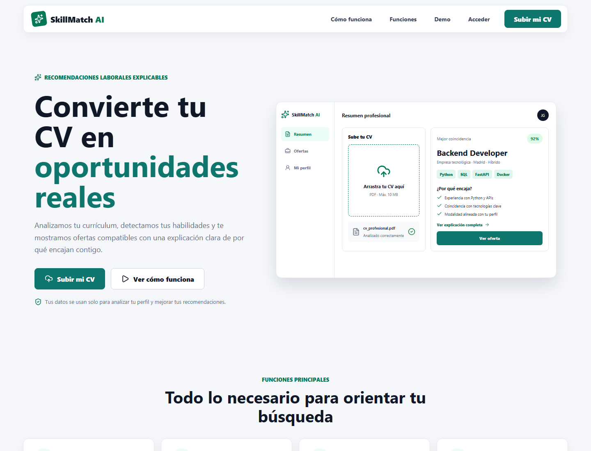

# SkillMatch AI

Aplicacion web que analiza un CV, construye un perfil profesional y ordena ofertas
tecnologicas por compatibilidad explicable.



## Que Problema Resuelve

Buscar empleo obliga a comparar manualmente el contenido de un CV con descripciones
de ofertas heterogeneas. Los portales suelen ordenar por palabras clave o criterios
opacos y no explican por que una oferta encaja.

SkillMatch AI automatiza ese trabajo:

1. Extrae texto de un CV PDF o DOCX.
2. Detecta skills, experiencia, idiomas, formacion y tipo de perfil.
3. Busca ofertas relacionadas con ese perfil.
4. Calcula una compatibilidad combinando reglas y similitud semantica.
5. Explica las coincidencias y las skills que faltan.
6. Permite guardar, descartar o marcar ofertas como postuladas.

El objetivo no es decidir por la persona candidata, sino reducir el tiempo de
revision y hacer visible el criterio usado en el ranking.

## Que Datos Usa

El proyecto trabaja con cuatro grupos de datos:

- **CV del usuario:** documento PDF/DOCX subido de forma privada. No se incluyen CV
  reales en el repositorio.
- **Diccionario de skills:** 90 habilidades versionadas en
  `data/skills/skills.es.json`, con categorias y aliases en espanol e ingles.
- **Taxonomia local:** 13 categorias tecnicas y aliases canonicos en
  `data/skills/skill_taxonomy.es.json`.
- **Ofertas de empleo:** Tecnoempleo como fuente activa por defecto e InfoJobs
  mediante su API oficial cuando existen credenciales. Se conserva fuente, URL,
  empresa, ubicacion, modalidad, requisitos y metadatos disponibles.

Tambien existe una oferta semilla en `data/sample_jobs/jobs.sample.json` para
pruebas controladas. El feedback del usuario se guarda como interacciones, pero
todavia no se usa para entrenar modelos.

## Decisiones Tecnicas

### Matching explicable

El score actual es:

```text
compatibilidad = 65% coincidencia de skills + 35% similitud semantica
```

- La parte de reglas compara skills normalizadas del perfil y de la oferta.
- La parte semantica usa
  `sentence-transformers/paraphrase-multilingual-MiniLM-L12-v2`.
- Los embeddings de 384 dimensiones se almacenan con pgvector.
- Cada resultado guarda ambos scores, explicacion y version del algoritmo
  (`hybrid-rules-semantic-v1`).

Se eligio un enfoque hibrido porque un embedding aislado aporta cobertura semantica,
pero las reglas permiten explicar coincidencias concretas.

### Procesamiento de CV

- PyMuPDF para PDF y python-docx para DOCX.
- Normalizacion de texto antes de extraer informacion.
- Diccionario y taxonomia local como fuente principal de skills.
- Patrones conservadores para terminos tecnicos no registrados.
- GLiNER opcional; el MVP no depende de entrenar un modelo propio.
- Solo un CV permanece activo por usuario para evitar rankings ambiguos.

### Seguridad

- Sesiones opacas almacenadas en PostgreSQL.
- Cookie HttpOnly; no se guardan tokens de sesion en `localStorage`.
- Contrasenas con Argon2id y migracion automatica desde bcrypt.
- Registro con respuesta generica para reducir enumeracion de emails.
- Verificacion de correo mediante token aleatorio de 24 horas, de un solo uso y
  almacenado solo como hash.
- Usuarios pendientes pueden autenticarse, pero no acceder a CV, ofertas o feedback.
- `email_outbox` prepara la futura integracion de correo; en desarrollo el enlace se
  escribe mediante `ConsoleEmailService`.

### Arquitectura

```text
Angular 18
    |
    | HTTP + cookie HttpOnly
    v
FastAPI + SQLAlchemy + servicios NLP/matching
    |
    v
PostgreSQL 16 + pgvector
```

El backend separa autenticacion, procesamiento de CV, importacion de ofertas,
embeddings y matching. Alembic versiona el esquema y Docker Compose levanta el
entorno local.

## Conclusiones

- La combinacion de reglas y embeddings produce un ranking interpretable sin
  entrenar un modelo desde cero.
- Normalizar skills antes de comparar es tan importante como la similitud semantica:
  reduce diferencias de aliases y tecnologias equivalentes.
- Mantener el CV activo, la version del algoritmo y los resultados persistidos hace
  el comportamiento reproducible.
- Las fuentes externas condicionan la calidad final. Por eso la aplicacion conserva
  atribucion y URL original, y trata InfoJobs como integracion opcional.
- El feedback ya queda estructurado para una fase supervisada futura, pero aun no hay
  evidencia suficiente para afirmar mejora predictiva.
- Antes de produccion faltan recuperacion de contrasena, proveedor de correo real,
  politica de borrado/retencion y evaluacion con un conjunto de CV-oferta etiquetado.

## Funcionalidades Actuales

- Registro, login, logout y restauracion de sesion.
- Verificacion y reenvio de correo.
- Subida y procesamiento de CV.
- Perfil profesional estructurado.
- Busqueda asincrona de ofertas por perfil.
- Recomendaciones paginadas y explicadas.
- Guardado, descarte y postulacion de ofertas.
- Perfil y ajustes de cuenta.
- Guards Angular y dependencias FastAPI para usuarios verificados.

## Stack

- Angular 18, TypeScript y SCSS.
- FastAPI, Python 3.12, SQLAlchemy, Alembic y Pydantic.
- PostgreSQL 16 y pgvector.
- sentence-transformers, spaCy, PyMuPDF y python-docx.
- Docker Compose y Nginx.

## Arranque Local

Requisitos: Docker Desktop y Docker Compose.

```bash
cp .env.example .env
docker compose up --build -d
```

En PowerShell:

```powershell
Copy-Item .env.example .env
docker compose up --build -d
```

Servicios:

- Frontend: http://localhost:4200
- Backend: http://localhost:8000
- Swagger/OpenAPI: http://localhost:8000/docs
- Healthcheck: http://localhost:8000/api/v1/health

En desarrollo, el enlace de verificacion aparece en:

```bash
docker compose logs backend
```

InfoJobs es opcional. Para activarlo, configure
`INFOJOBS_CLIENT_ID` y `INFOJOBS_CLIENT_SECRET` en `.env`.

## Pruebas

```bash
docker compose exec backend pytest -q
docker compose exec backend ruff check app tests

cd frontend
npm install
npm run test:ci
npm run build
```

Estado validado el 10 de junio de 2026:

- 57 pruebas backend superadas.
- 3 pruebas Angular de autorizacion superadas.
- Build Angular y lint backend correctos.

## Estructura

```text
backend/       API, modelos, migraciones y servicios
frontend/      Aplicacion Angular
data/          Diccionario, taxonomia y datos semilla
docs/          Documentacion tecnica
docker/        PostgreSQL y Nginx
storage/       CVs locales, excluidos de Git
tests/         Pruebas backend
```

## Documentacion

- [Estado actual](docs/estado-actual.md)
- [Arquitectura](docs/arquitectura.md)
- [API](docs/api.md)
- [Modelo de datos](docs/modelo-datos.md)
- [Fases](docs/fases.md)
