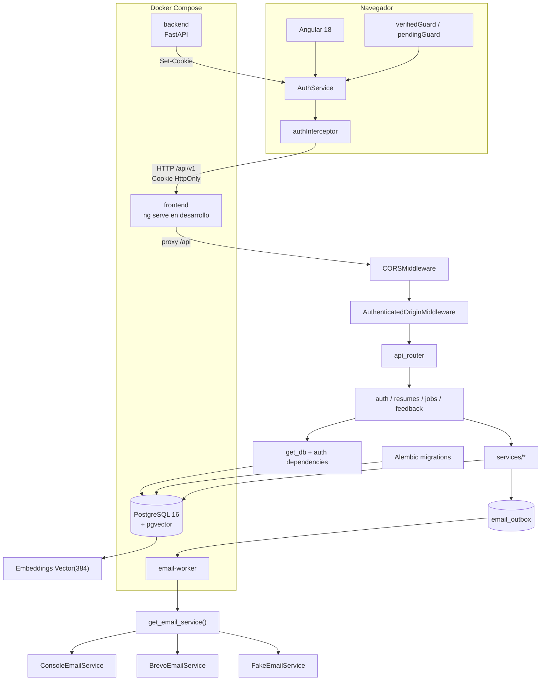

# 01. Arquitectura general del backend

## Diagrama

## Cómo fluye una petición

1. Angular llama a rutas relativas bajo `/api/v1`.
2. `authInterceptor` añade `withCredentials: true`, permitiendo que el navegador
   envíe la cookie `skillmatch_session`.
3. FastAPI aplica CORS y después `AuthenticatedOriginMiddleware`.
4. `api_router` deriva la petición al endpoint.
5. Las dependencias de `app/api/deps.py` resuelven sesión, usuario y permisos.
6. Los servicios contienen la lógica reutilizable y SQLAlchemy persiste en
   PostgreSQL.
7. Si debe enviarse un correo, el endpoint crea una fila en `email_outbox`.
8. El servicio Docker `email-worker` procesa esa fila posteriormente.

## Componentes principales

| Componente | Responsabilidad real |
|---|---|
| FastAPI | API REST, validación de dependencias y respuestas HTTP |
| SQLAlchemy 2 | Modelos ORM, consultas y transacciones |
| PostgreSQL + pgvector | Datos de negocio, autenticación, outbox, rate limits y embeddings |
| Alembic | Versionado del esquema |
| Angular `AuthService` | Estado de usuario en memoria y restauración de sesión |
| Cookie HttpOnly | Transporte del token opaco de sesión |
| `AuthenticatedOriginMiddleware` | Rechazo de escrituras autenticadas desde orígenes no permitidos |
| `email-worker` | Reclamación, validación y entrega de correos |
| Console/Brevo/Fake | Implementaciones intercambiables de `EmailService` |
| Docker Compose | Orquestación local de frontend, backend, DB y worker |

## Archivos implicados

- `backend/app/main.py`: `create_app()`, CORS, middleware y router.
- `backend/app/api/v1/router.py`: registro de routers.
- `backend/app/api/deps.py`: sesión y permisos.
- `backend/app/db/session.py`: `engine`, `SessionLocal`, `get_db()`.
- `backend/app/core/config.py`: `Settings`.
- `backend/app/workers/email_worker.py`: proceso de correo.
- `backend/alembic/env.py`: conexión de Alembic con `DATABASE_URL`.
- `frontend/src/main.ts`: interceptor y router.
- `frontend/src/app/features/auth/auth.service.ts`: estado de sesión.
- `frontend/src/app/core/auth.interceptor.ts`: `withCredentials`.
- `docker-compose.yml`: servicios locales.

## Puntos clave

- La API y el worker comparten modelos y servicios, pero son procesos separados.
- La entrega de correo no forma parte de la latencia del registro o del reset.
- PostgreSQL es también la cola de trabajo; no existen Redis ni Celery.
- En producción, `frontend/Dockerfile` genera Angular y Nginx redirige `/api/`.
- El despliegue productivo completo fuera de Docker Compose está **pendiente de
  verificar**, porque el repositorio no contiene infraestructura cloud.
