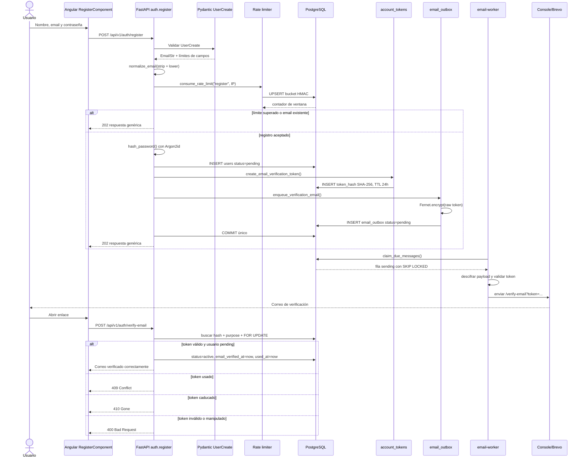

# 02. Registro y verificación de email

## Diagrama de secuencia

## Explicación

El registro está implementado en `register()`. El endpoint nunca confirma si un
email ya estaba registrado: tanto una alta válida como un duplicado o un rate limit
devuelven `202` con `REGISTRATION_MESSAGE`.

La contraseña se transforma antes de persistirse. El token de verificación se
divide conceptualmente en dos representaciones:

- `raw_token`: viaja cifrado dentro de `email_outbox` y finalmente en el enlace.
- `token_hash`: SHA-256 persistido en `account_tokens`.

El registro no crea `AuthSession` ni cookie. Angular redirige a
`/verify-email-sent`, que también funciona sin sesión.

## Estados durante la verificación

| Estado de usuario | Token válido | Resultado |
|---|---|---|
| `pending` | Sí | Cambia a `active`, establece `email_verified_at`, consume token |
| `active` | Sí | Respuesta idempotente, conserva estado y consume token |
| `disabled` | Sí | No reactiva; consume token y devuelve error prudente |

El reenvío usa `POST /api/v1/auth/resend-verification`, exige `get_pending_user`,
aplica cooldown de 60 segundos, máximo 5 solicitudes por hora e invalida tokens
anteriores sin usar.

## Archivos implicados

- `backend/app/api/v1/endpoints/auth.py`: `register()`, `verify_email()`,
  `resend_verification()`.
- `backend/app/schemas/auth.py`: `UserCreate`, `VerifyEmailRequest`.
- `backend/app/services/auth/identifiers.py`: `normalize_email()`.
- `backend/app/core/security.py`: `hash_password()`.
- `backend/app/services/auth/account_tokens.py`:
  `create_email_verification_token()`, `find_email_verification_token()`.
- `backend/app/services/email/outbox.py`: `enqueue_verification_email()`.
- `backend/app/services/email/crypto.py`: `EmailPayloadCipher`.
- `backend/app/services/email/templates.py`: `build_verification_url()`.
- `backend/app/models/user.py`: `User`, `UserStatus`.
- `backend/app/models/auth.py`: `AccountToken`, `EmailOutbox`.
- `frontend/src/app/features/auth/register.component.ts`.
- `frontend/src/app/features/auth/verify-email.component.ts`.

## Seguridad y arquitectura

- La búsqueda de email usa `func.lower(User.email)` para cuentas históricas.
- El token dura 24 horas y es de un solo uso.
- La lectura usa bloqueo `FOR UPDATE` para serializar consumos concurrentes.
- `hmac.compare_digest()` confirma el hash recuperado.
- No hay envío síncrono ni token de verificación en texto plano en la base.
- El mínimo backend de `UserCreate.password` es 8, mientras Angular exige 10. Esta
  discrepancia está verificada en código.

