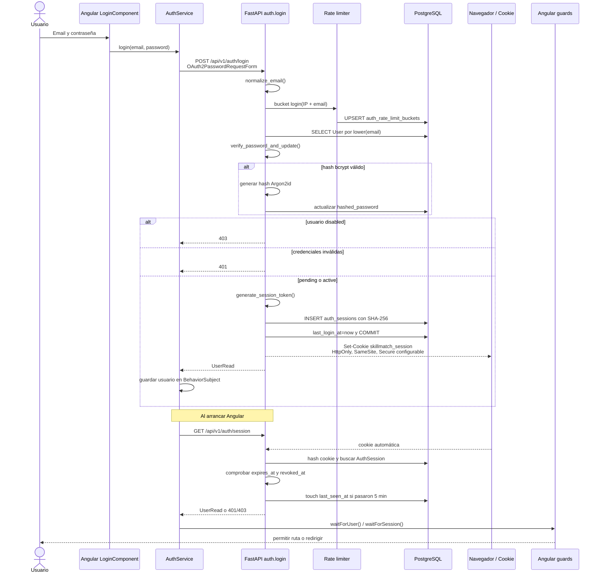
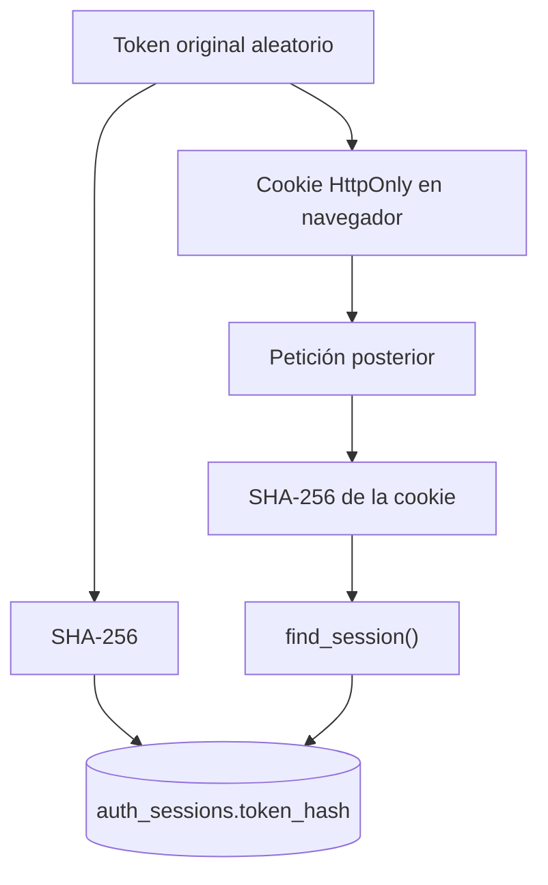

# 03. Login y sesiones opacas

## Diagrama de secuencia

## Qué es una sesión opaca

El token de sesión es un valor aleatorio generado con
`secrets.token_urlsafe(48)`. No contiene email, rol, expiración ni claims. Por eso
es "opaco": solo PostgreSQL puede resolverlo.

## Comportamiento por estado

- `pending`: puede iniciar sesión y consultar `/auth/session`, pero los endpoints de
  CV, ofertas y feedback fallan en `get_active_user`.
- `active` verificado: acceso normal.
- `disabled`: login devuelve `403`; una sesión ya existente también es rechazada por
  `get_current_session`.

`OAuth2PasswordRequestForm` solo define el formato `username/password`. El backend
no emite un bearer token, no implementa OAuth2 y no usa JWT.

## Ciclo de vida

- Duración: `SESSION_DAYS`, por defecto 30 días.
- Actividad: `touch_session()` actualiza `last_seen_at` como máximo cada 5 minutos.
- No existe renovación deslizante de `expires_at`.
- Login con una cookie previa revoca esa sesión antes de crear otra.
- Logout marca `revoked_at` y elimina la cookie.
- Reset de contraseña revoca todas las sesiones.
- Cambio desde Ajustes conserva solo la sesión actual.

## Archivos implicados

- `backend/app/api/v1/endpoints/auth.py`: `login()`, `session()`, `logout()`.
- `backend/app/services/auth/sessions.py`: generación, hash, búsqueda y revocación.
- `backend/app/core/security.py`: Argon2id y compatibilidad bcrypt.
- `backend/app/api/deps.py`: `get_current_session()`, `get_current_user()`.
- `backend/app/models/auth.py`: `AuthSession`.
- `frontend/src/app/features/auth/auth.service.ts`: `login()`, `restoreSession()`.
- `frontend/src/app/core/auth.interceptor.ts`: `withCredentials`.
- `frontend/src/app/core/auth.guard.ts`: guards.

## Seguridad

- Solo el hash de la sesión se persiste.
- La cookie es `HttpOnly`, `Path=/`, `SameSite=Lax` por defecto y `Secure` obligatorio
  en producción.
- No se utiliza `localStorage` ni `sessionStorage`.
- `last_seen_at` sirve para actividad operativa, no para prolongar la sesión.
- IP y user-agent se guardan en claro en `auth_sessions`.

