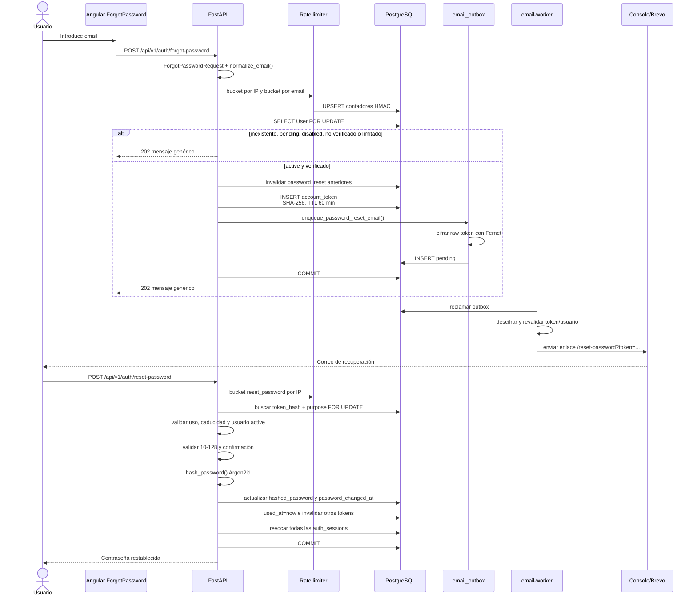

# 04. Recuperación de contraseña

## Diagrama de secuencia

## Explicación

`forgot_password()` está diseñado contra enumeración de usuarios. La respuesta
pública es siempre la misma, incluso si:

- el email no existe;
- la cuenta está `pending` o `disabled`;
- no está verificada;
- se ha alcanzado un límite.

El token se genera con `create_password_reset_token()`. Su hash queda en
`account_tokens`; el valor original solo queda recuperable dentro de
`email_outbox.encrypted_payload`.

`reset_password()` diferencia internamente token inexistente (`400`), usado (`409`)
y caducado (`410`), pero usa el mismo mensaje prudente:
`INVALID_RESET_LINK_MESSAGE`.

## Límites actuales

- TTL: `PASSWORD_RESET_TTL_MINUTES`, 60 por defecto.
- Por email/usuario: 5 solicitudes por hora.
- Por IP en `forgot-password`: 20 por hora.
- `reset-password`: 10 intentos por hora por IP.
- Un nuevo token invalida los anteriores sin usar.

## Archivos implicados

- `backend/app/api/v1/endpoints/auth.py`: `forgot_password()`, `reset_password()`.
- `backend/app/schemas/auth.py`: `ForgotPasswordRequest`,
  `ResetPasswordRequest`.
- `backend/app/services/auth/account_tokens.py`:
  `create_password_reset_token()`, `find_password_reset_token()`.
- `backend/app/services/email/outbox.py`: `enqueue_password_reset_email()`.
- `backend/app/services/email/templates.py`: `build_password_reset_url()`,
  `render_password_reset_email()`.
- `backend/app/services/auth/sessions.py`: `revoke_user_sessions()`.
- `frontend/src/app/features/auth/forgot-password.component.ts`.
- `frontend/src/app/features/auth/reset-password.component.ts`.

## Seguridad

- El endpoint no envía correo directamente.
- El worker cancela el correo si el token o el usuario dejan de ser válidos.
- El reset consume el token antes de confirmar la transacción.
- Todas las sesiones quedan revocadas para obligar a autenticarse con la nueva
  contraseña.
- La nueva contraseña nunca se guarda ni se introduce en logs.

