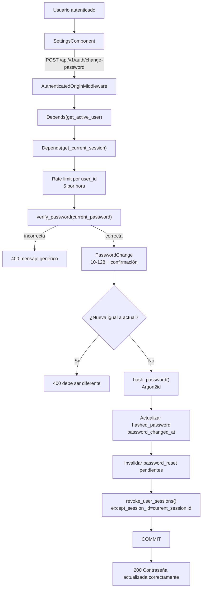

# 05. Cambio de contraseña desde Ajustes

## Diagrama

## Explicación

Este flujo requiere simultáneamente:

- una sesión opaca válida;
- un usuario `active`;
- `email_verified_at` no nulo.

`get_active_user` deriva de `get_current_user`, que a su vez depende de
`get_current_session`. La función del endpoint recibe además `current_session` para
conocer qué sesión debe conservar.

La contraseña actual se verifica con `verify_password()`, compatible con Argon2 y
bcrypt. La nueva contraseña siempre se guarda mediante `hash_password()`, por lo que
el resultado es Argon2id.

## Diferencia respecto al reset

| Operación | Sesión actual | Otras sesiones |
|---|---|---|
| `reset-password` | Revocada | Revocadas |
| `change-password` | Se conserva | Revocadas |

## Archivos implicados

- `backend/app/api/v1/endpoints/auth.py`: `change_password()`.
- `backend/app/api/deps.py`: `get_active_user()`, `get_current_session()`.
- `backend/app/schemas/auth.py`: `PasswordChange`.
- `backend/app/core/security.py`: `verify_password()`, `hash_password()`.
- `backend/app/services/auth/account_tokens.py`: `invalidate_account_tokens()`.
- `backend/app/services/auth/sessions.py`: `revoke_user_sessions()`.
- `frontend/src/app/features/settings/settings.component.ts`.
- `frontend/src/app/features/auth/auth.service.ts`: `changePassword()`.

## Seguridad

- La respuesta a una contraseña actual incorrecta es deliberadamente genérica.
- La confirmación se valida tanto en Angular como en Pydantic.
- Los tokens de recuperación pendientes dejan de ser útiles.
- La cookie actual no se rota; la sesión actual se conserva explícitamente.
- No existe historial de contraseñas ni comprobación contra contraseñas filtradas.
  Esa funcionalidad no está implementada.

