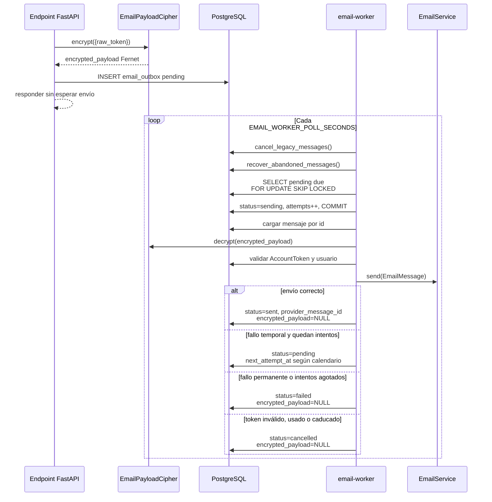
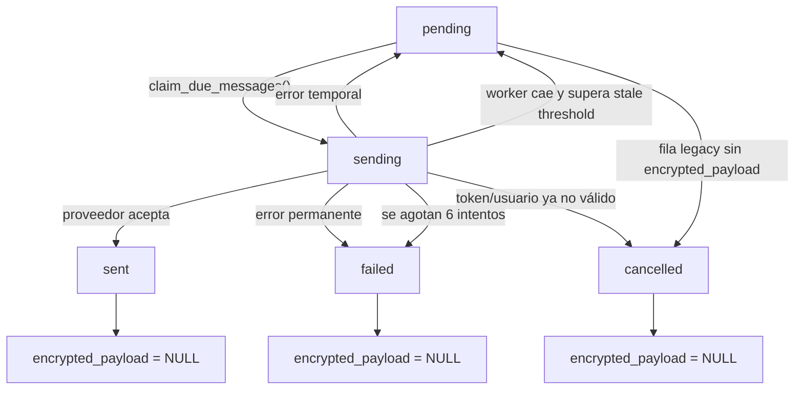
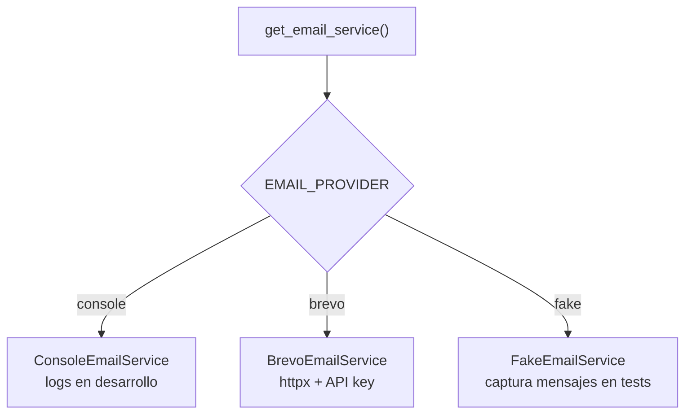

# 06. `email_outbox` y `email-worker`

## Flujo de procesamiento

## Máquina de estados

## Reintentos

`RETRY_DELAYS` contiene:

1. 1 minuto.
2. 5 minutos.
3. 15 minutos.
4. 60 minutos.
5. 240 minutos.

`EMAIL_MAX_ATTEMPTS=6` representa el intento inicial más cinco reintentos.

Brevo considera temporales:

- errores de transporte de `httpx`;
- HTTP `429`;
- HTTP `5xx`.

Los demás HTTP `4xx` son permanentes. Un payload Fernet corrupto también falla sin
reintento.

## Proveedores

`ConsoleEmailService` muestra contenido y enlace en desarrollo. Si se instancia en
producción, solo registra `EMAIL SENT TO CONSOLE`, sin destinatario ni contenido.
La configuración productiva, además, obliga a usar `brevo`.

## Archivos implicados

- `backend/app/models/auth.py`: `EmailOutbox`, `EmailOutboxStatus`.
- `backend/app/services/email/contracts.py`: `EmailService`, `EmailMessage`,
  `EmailDeliveryError`.
- `backend/app/services/email/crypto.py`: Fernet.
- `backend/app/services/email/outbox.py`: encolado, reclamación y procesamiento.
- `backend/app/services/email/providers.py`: Console, Fake y Brevo.
- `backend/app/services/email/templates.py`: HTML y texto.
- `backend/app/workers/email_worker.py`: bucle y parada por señales.
- `backend/alembic/versions/20260611_0009_email_outbox_worker.py`.
- `docker-compose.yml`: servicio `email-worker`.

## Puntos clave

- `FOR UPDATE SKIP LOCKED` permite varios workers sin reclamar la misma fila.
- La entrega es al menos una vez: una caída después de aceptar Brevo y antes del
  commit podría causar un duplicado.
- `recover_abandoned_messages()` recupera `sending` antiguos.
- `last_error` se sanitiza y limita a 1000 caracteres.
- Los logs normales del worker contienen ID y estado, no token ni payload.
- Rotar `EMAIL_PAYLOAD_ENCRYPTION_KEY` sin migrar filas pendientes impediría
  descifrarlas.

