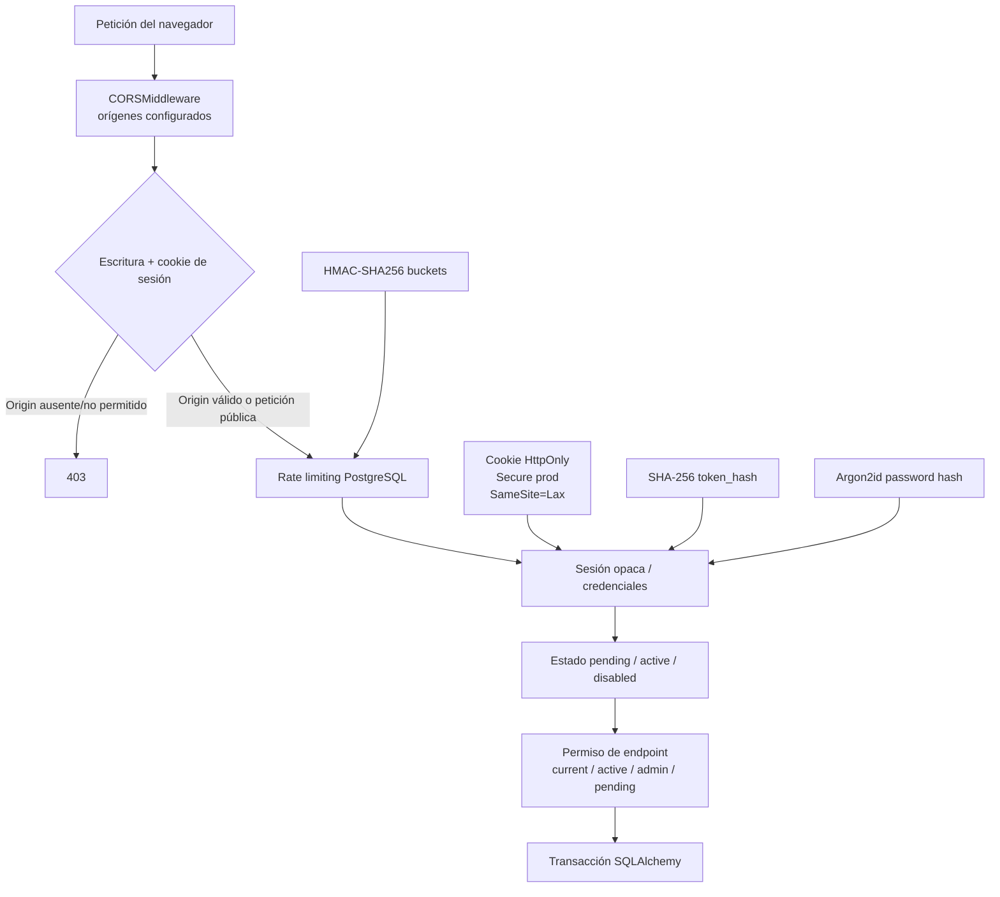
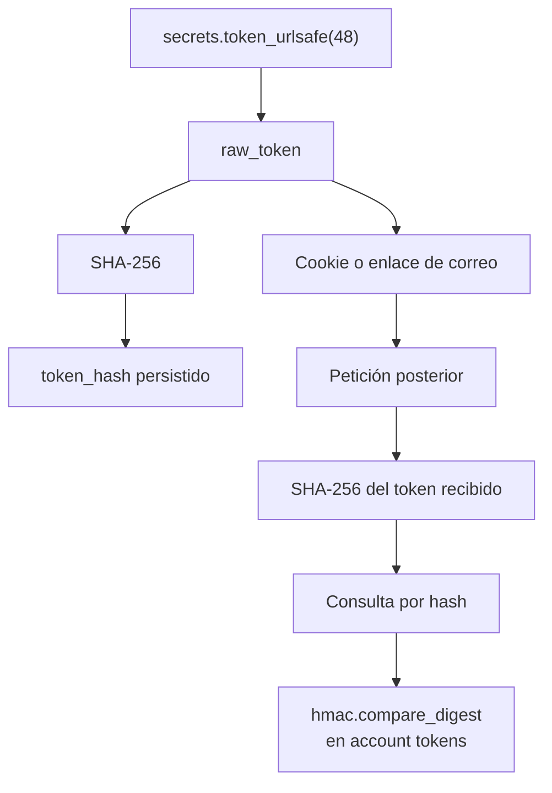
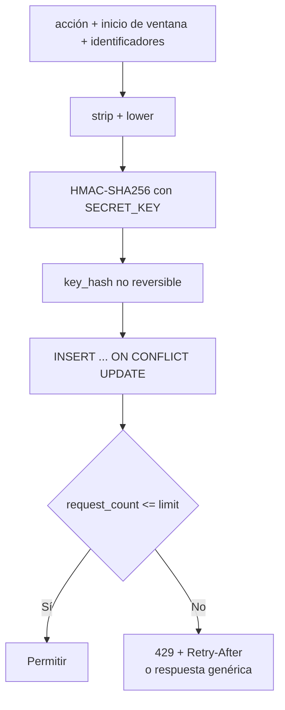

# 07. Seguridad de autenticación

## Capas de defensa

## JWT frente a sesión opaca

| Aspecto | JWT | Implementación actual |
|---|---|---|
| Contenido | Claims firmados dentro del token | Valor aleatorio sin datos |
| Validación | Puede ser local | Requiere consultar `auth_sessions` |
| Revocación | Necesita lista o TTL corto | `revoked_at` en PostgreSQL |
| Persistencia cliente | A menudo bearer/localStorage | Cookie HttpOnly |
| Uso en SkillMatch AI | No implementado | Sí, sesión opaca |

`OAuth2PasswordRequestForm` aparece en el login, pero solo procesa un formulario
compatible con los campos `username` y `password`. No se genera JWT ni bearer token.

## Token original y hash

## Cookies y CSRF

- `HttpOnly`: JavaScript no puede leer la cookie.
- `Secure`: obligatorio en producción; configurable en desarrollo.
- `SameSite=Lax`: reduce el envío cross-site en varios escenarios.
- `Path=/`: la cookie cubre toda la aplicación.
- Duración: `SESSION_DAYS`, 30 días por defecto.

La protección CSRF efectiva es `AuthenticatedOriginMiddleware`:

1. Solo examina `POST`, `PUT`, `PATCH` y `DELETE`.
2. Solo exige Origin cuando la petición ya trae la cookie de sesión.
3. Acepta `FRONTEND_URL` y `BACKEND_CORS_ORIGINS`.
4. Rechaza Origin ausente, inválido o externo con `403`.

`AuthSession.csrf_hash` existe y se rellena, pero el token CSRF original no se
entrega al frontend ni se valida. Por tanto, no hay double-submit token operativo.

## Rate limiting

| Acción | Límite por defecto | Identificador |
|---|---:|---|
| Login | 10 / 15 min | IP + email |
| Registro | 5 / hora | IP |
| Reenvío | 5 / hora + 60 s | user ID |
| Forgot password | 20 / hora | IP |
| Forgot password | 5 / hora | email |
| Reset password | 10 / hora | IP |
| Change password | 5 / hora | user ID |

Registro y `forgot-password` conservan respuesta genérica aunque se alcance el
límite. Los otros flujos pueden devolver `429` y `Retry-After`.

## Archivos implicados

- `backend/app/core/security.py`.
- `backend/app/services/auth/sessions.py`.
- `backend/app/services/auth/account_tokens.py`.
- `backend/app/services/auth/rate_limits.py`.
- `backend/app/core/request_security.py`.
- `backend/app/core/config.py`.
- `backend/app/api/deps.py`.
- `backend/app/main.py`.
- `frontend/src/app/core/auth.interceptor.ts`.

## Riesgos que siguen existiendo

- HttpOnly reduce robo del token, pero un XSS aún podría ejecutar acciones desde el
  navegador autenticado.
- La estrategia depende de que el navegador envíe `Origin` en escrituras
  autenticadas.
- IP y user-agent de sesión se persisten en claro.
- `TRUST_PROXY_HEADERS=true` solo es seguro detrás de un proxy confiable que
  sobrescriba `X-Forwarded-For`.

