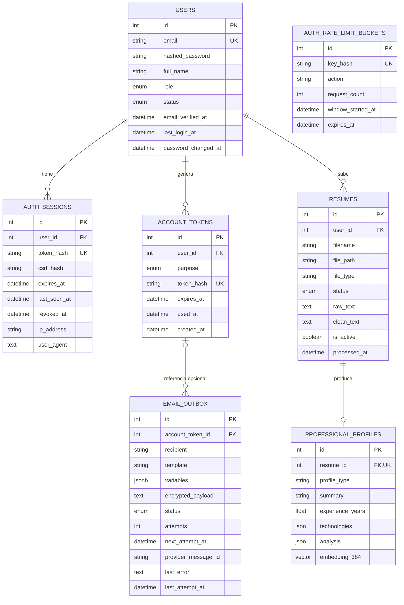

# 08. Modelo de base de datos de autenticación y perfil

## Diagrama entidad-relación

`AUTH_RATE_LIMIT_BUCKETS` no tiene relación por clave foránea con `USERS`: sus
identificadores están anonimizados mediante HMAC y pueden representar IP, email o
user ID según el flujo.

## Responsabilidad de cada tabla

### `users`

Identidad principal. `email` es único e indexado. La contraseña se guarda en
`hashed_password`; no existe una columna para contraseña en claro.

Estados:

- `pending`: puede iniciar sesión, verificar y reenviar correo.
- `active`: requiere además `email_verified_at` para funciones verificadas.
- `disabled`: login y sesiones son rechazados.

### `auth_sessions`

Fuente de verdad de las sesiones opacas. `token_hash` es único. El índice
`ix_auth_sessions_user_active` optimiza consultas por usuario, revocación y
expiración. `ON DELETE CASCADE` elimina sesiones al borrar el usuario.

### `account_tokens`

Almacena tokens de propósito `email_verification` o `password_reset`. El índice
compuesto por usuario y propósito ayuda a invalidar tokens anteriores.

### `email_outbox`

Cola persistente. `account_token_id` es nullable y usa `ON DELETE SET NULL`.
`ix_email_outbox_pending(status, next_attempt_at)` soporta la reclamación del
worker.

### `auth_rate_limit_buckets`

Ventanas fijas persistentes. `key_hash` es único y no permite recuperar los
identificadores originales. Tiene índices por acción y expiración.

### `resumes`

CV de un usuario. Guarda ruta y textos extraídos. El código desactiva el CV anterior
al subir uno nuevo, aunque la migración `0003` normaliza los datos existentes sin
crear un índice único parcial.

### `professional_profiles`

Relación uno-a-uno con `resumes` mediante `resume_id` único. La tabla real no se
llama `profiles`; su nombre exacto es `professional_profiles`.

## Datos sensibles

| Dato | Protección actual |
|---|---|
| Contraseña | Hash Argon2id o bcrypt legado |
| Token de sesión | Solo SHA-256 en DB |
| Token de cuenta | Solo SHA-256 en `account_tokens` |
| Token necesario para correo | Fernet en `encrypted_payload` |
| Email y destinatario | Texto claro |
| IP y user-agent | Texto claro |
| Texto extraído del CV | Texto claro |
| Embedding | Vector de 384 dimensiones |

## Migraciones relevantes

- `20260610_0008_auth_foundation.py`: usuarios, sesiones, tokens y outbox.
- `20260611_0009_email_outbox_worker.py`: payload cifrado y campos operativos.
- `20260611_0010_security_rate_limits.py`: buckets persistentes.
- `20260508_0001_initial_schema.py`: usuarios, CV y perfiles iniciales.
- `20260508_0002_active_resume_profile_type.py`: `is_active` y `profile_type`.
- `20260508_0003_single_active_resume.py`: normalización del CV activo histórico.

## Archivos implicados

- `backend/app/models/user.py`.
- `backend/app/models/auth.py`.
- `backend/app/models/resume.py`.
- `backend/app/models/profile.py`.
- `backend/alembic/versions/`.
- `backend/app/db/base.py`.
- `backend/app/db/session.py`.
