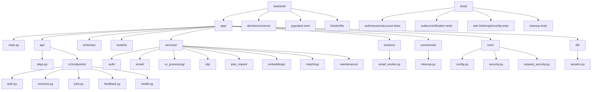
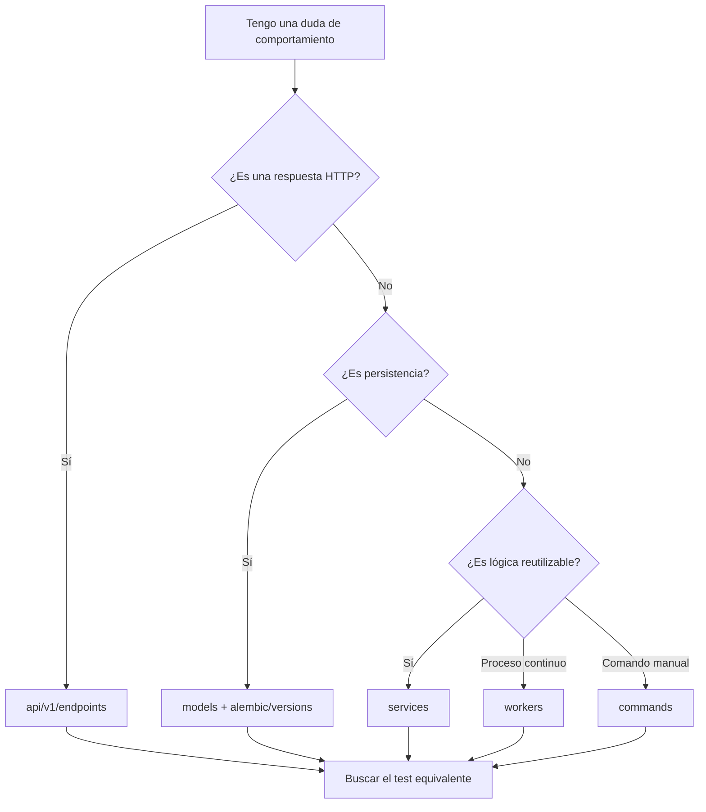

# 09. Mapa de archivos del backend

## Mapa visual

## Responsabilidades por carpeta

| Ruta | Responsabilidad |
|---|---|
| `app/api/v1/endpoints/` | Contratos HTTP, códigos de respuesta, dependencias y transacciones |
| `app/schemas/` | Validación y serialización Pydantic |
| `app/models/` | Tablas, enums, relaciones e índices SQLAlchemy |
| `app/services/` | Lógica reutilizable independiente del transporte HTTP |
| `app/workers/` | Procesos de larga duración separados de FastAPI |
| `app/commands/` | Entradas CLI operativas |
| `app/core/` | Configuración, hashing y middleware transversal |
| `app/db/` | Base declarativa, engine, factoría y dependencia de sesión |
| `alembic/versions/` | Historial versionado del esquema |
| `tests/` | Pruebas de autenticación, correo, seguridad y dominio |

## Archivos de autenticación

### API y dependencias

- `app/api/v1/endpoints/auth.py`: registro, verificación, login, logout, sesión,
  recuperación y cambio de contraseña.
- `app/api/deps.py`: `get_current_session`, `get_current_user`,
  `get_active_user`, `get_admin_user`, `get_pending_user`.
- `app/api/v1/router.py`: monta `/auth`, `/resumes`, `/jobs`, `/feedback`.

### Modelos y schemas

- `app/models/user.py`: `User`, `UserRole`, `UserStatus`.
- `app/models/auth.py`: `AuthSession`, `AccountToken`, `EmailOutbox`,
  `AuthRateLimitBucket`.
- `app/schemas/auth.py`: payloads y respuestas.

### Servicios auth

- `app/services/auth/identifiers.py`: normalización de email.
- `app/services/auth/sessions.py`: sesión opaca y cookie.
- `app/services/auth/account_tokens.py`: tokens de verificación y reset.
- `app/services/auth/rate_limits.py`: buckets HMAC en PostgreSQL.

### Servicios email

- `app/services/email/contracts.py`: protocolo `EmailService`.
- `app/services/email/crypto.py`: `EmailPayloadCipher`.
- `app/services/email/outbox.py`: encolado y máquina de estados.
- `app/services/email/providers.py`: Console, Fake y Brevo.
- `app/services/email/templates.py`: enlaces, texto y HTML.

### Operación

- `app/workers/email_worker.py`: bucle del worker y parada controlada.
- `app/services/maintenance/cleanup.py`: selección y eliminación de temporales.
- `app/commands/cleanup.py`: CLI con `--dry-run`.
- `app/core/config.py`: variables y validación productiva.
- `app/core/request_security.py`: validación de Origin.
- `app/core/security.py`: Argon2id y bcrypt legado.

## Mapa de tests

| Archivo | Cobertura principal |
|---|---|
| `tests/test_auth_sessions.py` | Sesiones, cookie, login, expiración y bcrypt |
| `tests/test_email_verification.py` | Registro, tokens, estados y reenvío |
| `tests/test_password_reset.py` | Forgot/reset y revocación |
| `tests/test_auth_account.py` | Cambio de contraseña y Argon2id |
| `tests/test_auth_dependencies.py` | Pending, active, admin y guards backend |
| `tests/test_email_outbox.py` | Fernet, proveedores, worker y reintentos |
| `tests/test_rate_limits.py` | HMAC, contadores y proxy headers |
| `tests/test_request_security.py` | Origin y CORS |
| `tests/test_auth_config.py` | Requisitos de producción |
| `tests/test_cleanup.py` | Dry-run, recuperación y borrado |
| `tests/test_auth_models.py` | Registro de modelos y enums |

## Cómo localizar un comportamiento

## Puntos clave

- Los endpoints coordinan; los servicios encapsulan la lógica reutilizable.
- Las migraciones son la fuente histórica del esquema, no los modelos por sí solos.
- Muchos tests usan dobles de `Session`; no toda la suite es integración real con
  PostgreSQL.
- No existe una carpeta o módulo JWT.
- El scheduler productivo para ejecutar `cleanup` periódicamente está **pendiente
  de verificar** porque no aparece en el repositorio.

