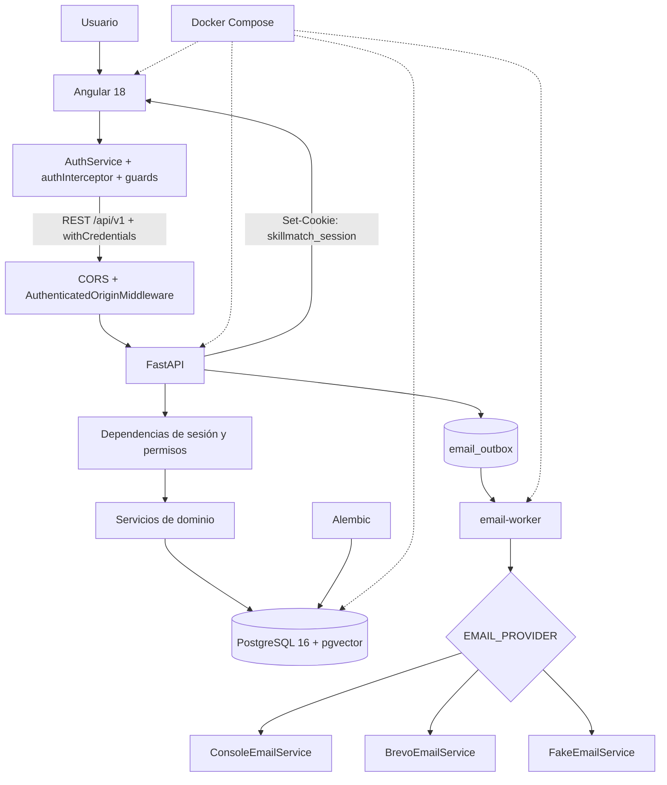

# Infografías técnicas del backend de SkillMatch AI

Esta carpeta explica visualmente la arquitectura y los flujos internos de
SkillMatch AI. Los diagramas se han contrastado con el código actual del
repositorio, no solo con la documentación descriptiva.

> Nota de fuentes: no existe en el repositorio un archivo llamado
> `documentacion_backend_skillmatch.md`. Para esta guía se han utilizado
> `docs/arquitectura.md`, `docs/api.md`, `docs/modelo-datos.md`,
> `docs/estado-actual.md` y los archivos reales de backend y frontend.

## Recorrido recomendado

| Orden | Infografía | Pregunta que responde |
|---|---|---|
| 1 | [Arquitectura general](01-arquitectura-general.md) | ¿Qué componentes existen y cómo se comunican? |
| 2 | [Registro y verificación](02-registro-verificacion-email.md) | ¿Cómo nace y se activa una cuenta? |
| 3 | [Login y sesiones](03-login-sesiones.md) | ¿Cómo se autentica y mantiene una sesión? |
| 4 | [Recuperación de contraseña](04-recuperacion-password.md) | ¿Cómo funciona un reset seguro? |
| 5 | [Cambio de contraseña](05-cambio-password.md) | ¿Qué ocurre desde Ajustes? |
| 6 | [Outbox y worker](06-email-outbox-worker.md) | ¿Cómo se envía correo sin bloquear la API? |
| 7 | [Seguridad de autenticación](07-seguridad-auth.md) | ¿Qué defensas protegen cada flujo? |
| 8 | [Modelo de base de datos](08-modelos-bbdd.md) | ¿Dónde se persiste cada dato? |
| 9 | [Mapa de archivos](09-mapa-archivos.md) | ¿Dónde vive cada responsabilidad? |

## Vista rápida

## Convenciones

- **Token original**: valor aleatorio que solo necesita el navegador o el correo.
- **`token_hash`**: SHA-256 persistido para localizar y validar un token sin
  guardarlo en claro.
- **Payload cifrado**: JSON protegido con Fernet para que el worker pueda recuperar
  temporalmente un token que debe incluirse en un enlace.
- **Usuario activo**: `status=active` y `email_verified_at` no nulo.
- **Sesión opaca**: identificador aleatorio sin claims ni datos de usuario embebidos.

## Estado verificado

- No se usa JWT para la autenticación.
- No se guardan tokens en `localStorage` ni `sessionStorage`.
- Registro y recuperación no envían correo de forma síncrona.
- PostgreSQL actúa como fuente de verdad, cola de correo y almacén de rate limiting.
- `csrf_hash` está preparado en `auth_sessions`, pero no existe un flujo
  double-submit operativo. La defensa CSRF aplicada es `Origin` + `SameSite=Lax`.
